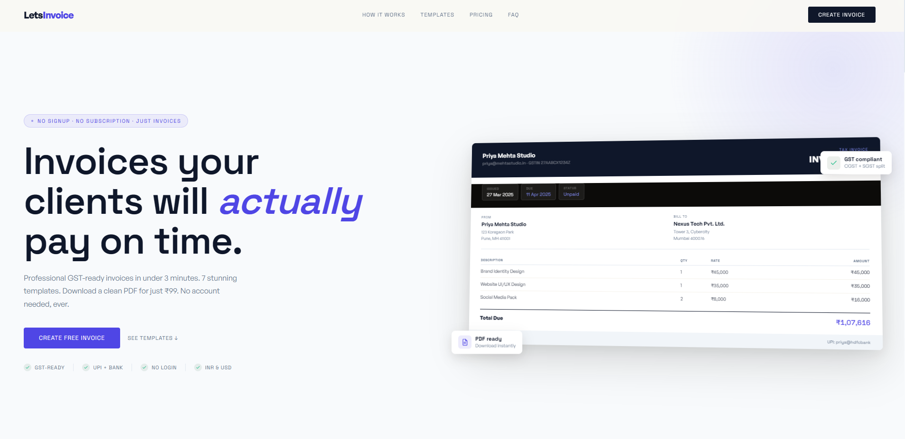

<div align="center">
  
  
  # LetsInvoice
  
  **A beautifully simple, client-side invoice generator.**
  
  [Live Demo](https://letsinvoice-seven.vercel.app/) • [Repository](https://github.com/SoumyadipSil/LetsInvoice)
</div>

---

## 🌟 Features

- **100% Client-Side:** No databases, no sign-ups. Your data never leaves your browser; it's saved locally via `localStorage`.
- **Premium Aesthetic:** Designed with a sleek, modern, glassmorphic UI featuring a striking Indigo and Slate color palette.
- **Native PDF Export:** Generates crisp, vector-quality, text-selectable A4 PDFs using the browser's native print engine.
- **Smart Fields:** Empty fields (like Discount, Tax, Date) automatically hide themselves to keep your final invoice perfectly clean.
- **Customizable Labels:** Not generating an invoice? Easily change the document title to "Quote", "Proforma", or "Receipt", and customize "From" / "Bill to" fields.
- **Multiple Templates:** Switch between 7 distinct professional templates instantly.

## 🚀 Getting Started

Since LetsInvoice is a pure Vanilla JS/HTML/CSS application, there's no build step required!

### Running Locally

1. Clone the repository:
   ```bash
   git clone https://github.com/SoumyadipSil/LetsInvoice.git
   ```
2. Open the directory:
   ```bash
   cd LetsInvoice
   ```
3. Open `index.html` in your favorite web browser, or use a local server (like Live Server or `npx serve`) for the best experience.

### Deployment

This project is deployed on [Vercel](https://vercel.com). Because it requires no build step, you can deploy it instantly by connecting your GitHub repository to Vercel and leaving the build command empty.

## 🛠 Tech Stack

- **HTML5:** Semantic structure and accessible forms.
- **CSS3 (Vanilla):** Custom CSS Variables, Flexbox, CSS Grid, and Print Media Queries (`@media print`).
- **JavaScript (Vanilla):** DOM manipulation, local state management, and HTML string template rendering.

## 🖨 PDF Export Notes

LetsInvoice utilizes the native `window.print()` functionality for the highest quality PDF generation.
- **Background Graphics:** We use `-webkit-print-color-adjust: exact;` to ensure template colors and headers are printed flawlessly.
- **No Blurry Canvas:** By relying on CSS `@media print` instead of third-party snapshot libraries (like `html2canvas`), the exported PDFs have crisp, selectable text.

## 📄 License

This project is open-source and available under the MIT License.
